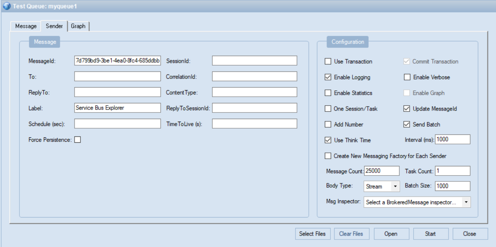
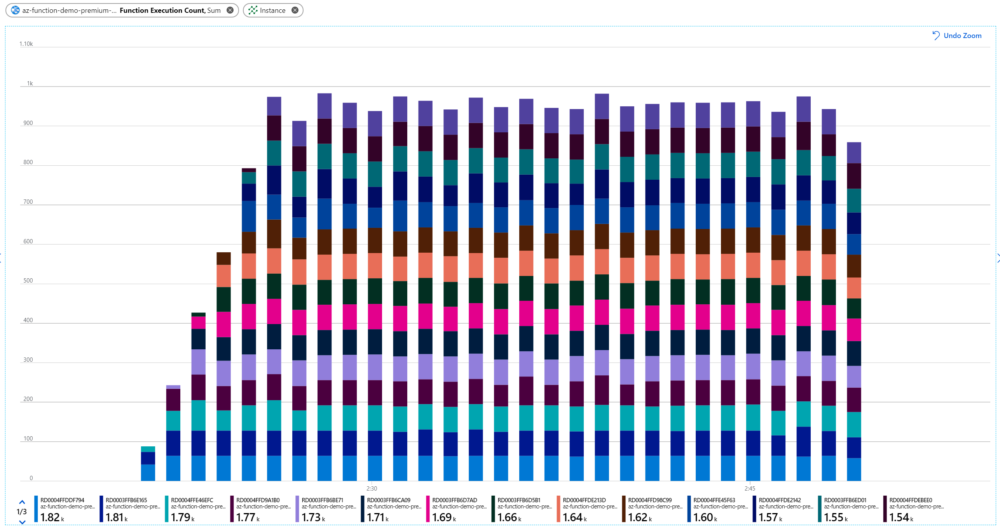
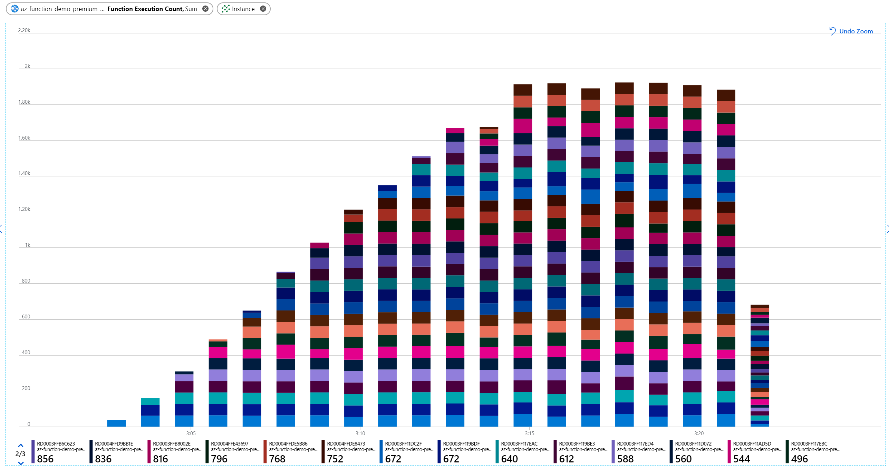
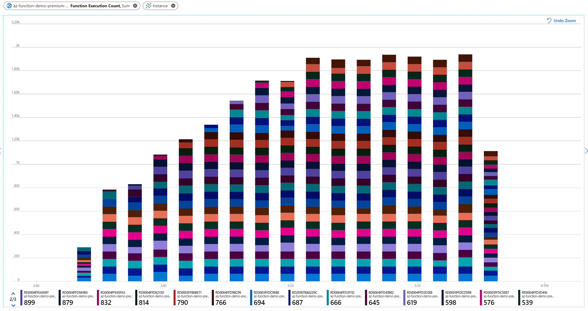

# Understanding Function scaling in a Premium Plan

## Scaling Scenarios

### Load Configuration

### Scenario 1
Minimum Instances: 1
Maximum Instances: 15

### Scenario 2
Minimum Instances: 1
Maximum Instances: 30

### Scenario 3
Minimum Instances: 20
Maximum Instances: 30

## Reference

* https://docs.microsoft.com/en-us/azure/azure-functions/functions-scale
* https://docs.microsoft.com/en-us/azure/azure-functions/functions-best-practices#scalability-best-practices